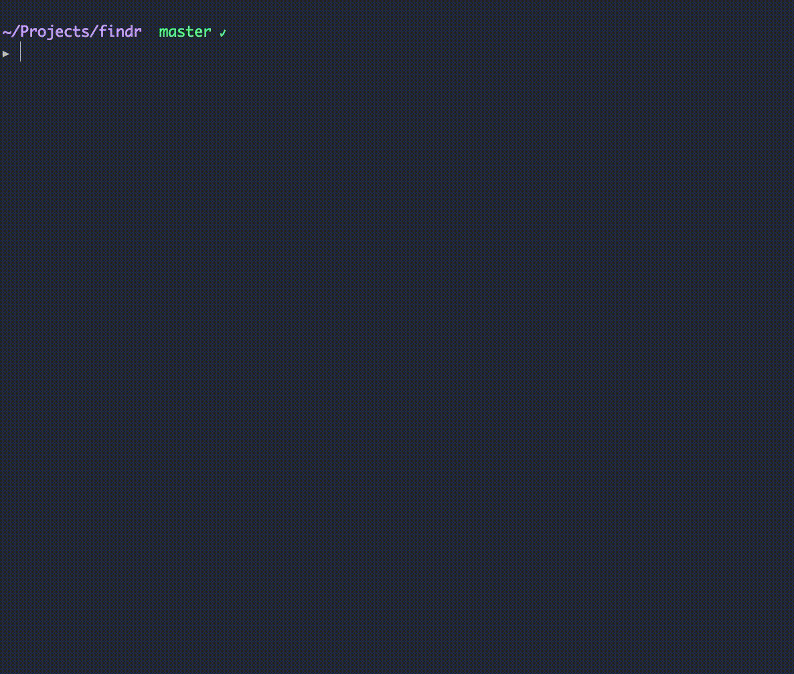

<p align="center">
  <br />
   
</p>
<p align="center">
   <a href="#preview">Preview</a> •
   <a href="#features">Features</a> •
   <a href="#commands">Commands</a> •
   <a href="#license">License</a> 
</p>
<br/>

## Preview
<p align="center">
  <br />
  
  <p align="center"><b><i>Find command</i></b></p>
  <p align="center"> </p>
</p>
<br/>
<p align="center">
  <br />
 
  <p align="center"><b><i>Replace command + regex</i></b></p>
  <p align="center"> </p>
</p>

## Installation
```
npm i -g @vmarcosp/findr
```

## OS Support
- :white_check_mark: &nbsp; Mac
- :white_check_mark: &nbsp; Linux
- :white_check_mark: &nbsp; Linux
- :gear: &nbsp; Windows *(WIP)*

## Features

- :white_check_mark: &nbsp; Find
- :white_check_mark: &nbsp; Replace
- :white_check_mark: &nbsp; Colorized output
- :white_check_mark: &nbsp; Highlight and preview occurrences
- :white_check_mark: &nbsp; Select files to replace
- :white_check_mark: &nbsp; Regex support
- ⚙️  &nbsp; Select ocurrences to replace *(WIP)*

## Commands

### Find command:
Positional arguments:
  - 1º *Text to find*

Named arguments:
  - `--folder` or `-f`
  - `--regex` or `-r` regex mode
  - `--extension` or `-e` filter files by extension


Example:
```sh
  # Basic usage
  findr find "write_file" --folder src

  # Filtering by extension
  findr find "write_file" --folder src --extension re,js
```

### Replace command:
Positional arguments:
 - 1º *Text to replace*
 - 2º *New text*

Named arguments:
  - `--folder` or `-f`
  - `--regex` or `-r` *regex mode*
  - `--extension` or `-e` filter files by extension


Example:
```sh
  # Basic usage
  findr replace "write_file" "create_file" --folder src

  # Regex mode
  findr replace "\bwrite_file" "create_file" --folder src --regex
```

## License

MIT
